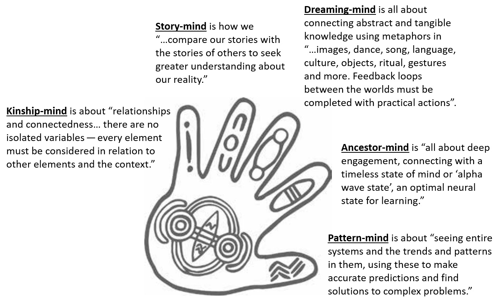

# The Importance of Inferring Intention

*In which I outline a framework for legibly, reliably, and modularly improving our innate capacity to
infer intention within ourselves and other agentic entities we interact with. This framework has yet
to be implemented or validated, but if successful will act as both a pedagogical tool for improving
our intrinsic innate ability to infer intentions, but also as a type of prosthesis like a pair of
eyeglasses that can help us see the web of intentionality that surrounds our very existence.*

The concept of intention points to the capacity to perceive and act in relation to intrinsic
values. As part of our subjective landscape, intention is never fully explicit. Indeed, intention is
often internally implicit, and may only occasionally surface consciously. Our emotional landscape
points to our forming and holding intentions inasmuch as our stream of consciousness. There is
nothing incompatible about holding multiple intentions, for we can want to become multiple things
simultaneously. In fact, there is nothing preventing us from holding incompatible
intentions. History is littered with examples of how we can fail to realize our intentions are
incompatible and therefore perform self-defeating, aborted, and/or ineffectual actions. As social
creatures, humans have the capacity to internally model themselves and their peers to varying
degrees of accuracy. One skill this enables is that we are able to infer intentions. I propose that
inferring intentions is an essential skill for our past and future success as a species as well as
for sustaining the beauty and habitability of our living planet.

As society becomes more interconnected, digital, and pluralistic, reliably inferring intention
becomes ever more important. Because we interact with a larger number of beings than ever before,
our innate ability to infer intention has become saturated. Paradoxically this both increases
distrust and gullibility across our social landscape. Our capacity to appropriately modulate between
suspicion and trust has been overwhelmed. I propose that our internal models of self are radically
incomplete and insufficient. Collectively, we seem to overly stereotype each other as friend or
foe. Equally worrisome, there are many important players in our world that we fail to recognize as
having intention, such as corporations, governments, ecosystems and other forms of collective
organization. In this latter case we do not even apply appropriate stereotypes and are incapable of
inferring intention to their actions, even when such intention is actually present.

I believe the state of our technology and knowledge is advanced enough to start to create cognitive
prostheses that can help us to reliably infer intentionality. If possible, this would have dramatic
effects on our capacity for [collective
sense-making](https://consilienceproject.org/challenges-to-making-sense-of-the-21st-century/). Whether
such prostheses are a physical technology like eyeglasses or a psycho technology like writing or
something in between remains to be seen. Once applied, such technology would help us to remove much
of the "fog of war" in identifying allies and enemies within our natural and social landscapes. If
we could infer intention more reliably, then the downstream impacts of naive gullibility and
distrust would be reduced. By reliably inferring intentions, we could quickly identify
incompatibilities in intention and therefore have less reason to fall into sunk cost fallacies and
resort to violent conflict as our positions become entrenched. Additionally, through quicker
identification of the "lines of conflict" where we can see the greater social landscape of those who
hold compatible and incompatible intentions diplomatic resolutions to our conflicts becomes more
probable. We would be able to remove much of the guesswork in coalition building and creating
mutually acceptable negotiation proposals. Finally, if we collectively become more aware of
intentions, then through careful study we can start to accurately predict their consequences, as
together we learn how intentions harmonize and conflict with one another within particular contexts.

By *reliably* inferring intention I am pointing to the quickness, accuracy, and comprehensiveness of
our innate capacity to infer intentions. All three characteristics must be improved given the sheer
number of entities exhibiting agency we encounter compared to what was present during our prehistory
when we evolved our innate capacities for intention inference. Our physical and digital world is
littered with objects that are imbued with intention. Each human made artifact, whether garbage or
treasure contains a whole train of intentions leading to its current state. The junk food wrapper on
the ground speaks to the innate body's craving for calorie dense foods; it speaks to the company's
intention to produce what sells and not necessarily what is good; and it generally speaks to the
consumer's lack of conscious intention. The natural world is just as filled such artifacts of
intention, for example the soil we tread on speaks volumes on intentions of an ecosystem of
creatures to grow, eat, digest, absorb.

Intentions, properly traced, are a proper [efficient
cause](https://plato.stanford.edu/entries/aristotle-causality/) for understanding our animate and
material landscapes. I propose that our ability to model intention likely binds us to particular
places and people as much as our affinity or affection for them. When we are capable of reliably
inferring intention, the world is imbued with greater degree of comprehensibility. Might this help
explain why some people seem stuck in abusive or ineffectual relationships even when they are aware
of how things could be different? If we could readily find the through-line of efficient cause back
from action or object to intention, then our level of comfort and expertise with the world at large
is sure to increase. By better inferring intention, we are therefore priming the world to be a more
comprehensible, happy place. Not only will it make more sense, but our gullibility is bound to also
decrease.

One is less gullible when one can reliably infer intention. Gullibility may result in entrapment,
where an agent is lead into a position that they believe is in their advantage but actually enables
another to take advantage of them. Such situations occur when there is an asymmetrical understanding
of intention between the interacting agents. Would a fish catch a lure if they knew of the intention
that placed it there? If we are to reliably infer intention, not only must we be able to better
model the intention of agents, we must be more competent at generally inferring agency within the
world.

There are more entities in the world with the capacity to hold intentions than individual human
beings. Social organizations such as governments, families, and companies hold intentions; living
organisms, both on the species level and individual level, hold intentions; ecosystems and other
commons can even hold intentions. To hold intentions, the only properties that an entity must be
able to represent are an awareness of their current state, their "cognitive being", a desired state,
their "cognitive becoming", and the ordering between the two states. Different entities have
radically different capacities in their ability to conceive of being and becoming, but for the
purpose of inferring intention their actual cognitive state is not important. Instead, so long as
our representation of their intention demonstrates higher [causal
emergence](https://www.theintrinsicperspective.com/p/a-primer-on-causal-emergence) than a control
scenario, it is advantageous to treat that entity as an agent.

Causal emergence as a concept was coined by Erik Hoel and his coauthors and shows how in certain
cases higher scale representations of a system have more causal predictive power than their
underlying lower scale representations. So what I'm proposing is that certain collectives are best
described using the high order representation of agency, and that representation has more causal
power than viewing the collective as the sum of its parts. Indeed, if in reference to causal
emergence, collectives are in some cases best described as individual agents might the reverse be
true as well and individual agents be better described as collectives? I propose so, and interest
and efficacy of psychological systems such as Internal Family Systems may support this proposition.

Our limited ability to reliably infer intentions is harming our ability to live together
harmoniously. How then are we to proceed? The only generally acceptable answer, so long as we assume
that the world does not decrease in speed and interconnectedness, is to individually and
collectively become better at inferring intention. So long as we live in a globally connected
pluralistic and digital reality, our innate capacity for navigating the landscape of social behavior
is not up to the task. We must improve our collective capacities for intention
inference. Unfortunately our ability to understand even our own intentions is limited. We cannot
keep blindly trying to improve this innate capacity. The pace of societal and technological progress
is too great for our natural and mimetic evolution to accommodate our present need.

It's likely that to make progress we need a robust theoretical foundation upon which to scaffold a
suitable model of intention formation. This presents a problem, as intention points at a component
of cognitive processes and therefore lies within subjective reality. It is therefore not conducive
to study within the current paradigms of "hard" science. Intention is a phenomenological state. It
is part of our cognitive landscape and when it is legible at all, it is only intrinsically so. By
legible, I mean it must be inter-subjectively understandable, just as language is. This produces a
daunting technological and philosophical challenge, for to start structurally addressing this issue
we need to legibly model the structures and relationships from which intentions emerge.

Legibly inferring intention likely doesn't require resolving the [hard problem of
consciousness](https://iep.utm.edu/hard-problem-of-conciousness/), but it appears uncomfortably
close. Intention can be subconscious, and if we were to imagine there's a clear divide between
objective and subjective reality intention must "live" close to the fulcrum of that divide, for it
is instrumental in how thought can turn into action. Can we make progress without having a
well-validated theory on the nature of subjective versus objective reality? The need to better infer
intentions is very real and very pressing, and intentions lie somewhere in that particular Gordian
knot so let's hope so.

To my knowledge there are no existing projects oriented towards improving our capacity for reliably
inferring intentions. I believe that needs to change. I am far from an expert in the required
domains to proceed. I am just naive enough to make an attempt. I do not feel adequate to this task
but I do feel motivated to try. If there are existing programs of this nature, I want to help in
whatever way I can. Until I find such work, I will focus on trying to lay the groundwork of what
such a program might look like. I will attempt identify the principle constraints to improving our
innate capacity for inferring intentions and provide a rough proposal for a program oriented towards
improving our collective capacities in this regard.

In general, it is hard to untangle whether a successful untangling of this problem calls for better
theory or better design. Our existential need is not to recreate cognition, but rather to enhance
our innate capabilities such that they are up to the task of sense-making within our globally
interconnected pluralistic and digital society. As such, we need a framework for improving our
innate capabilities, not a program to design new ones.

To infer intention for an agent, one must simultaneously have awareness of the objective facts
surrounding that agent that are relevant to its intentions while also consolidating and
extrapolating from those facts into a likely set of intentions that the modeled agent holds. In
order to improve on our innate capacity to infer intention, the whole process from identifying
facts, extrapolating from those facts, through inferring from those extrapolations must be legible
enough that the person using inferred intentions stays in control of the underlying
process. Otherwise, we are not improving our sense-making capacities, we are replacing our agency
with self-mimicry. What we need is a legible framework that can help us to identify what intentions
an agent likely holds, how strongly they likely identify with such intentions, and why it is likely
that way.

As you can tell, nothing about this process can be definite, but that does not mean it cannot be
informative.

Intention is a cognitive, but not necessarily conscious process. Intention forms at the intersection
between cognition of where-one-is with where-one-wants-to-be. As such, it occurs though consilience
between [Is and Ought](https://en.wikipedia.org/wiki/Is%E2%80%93ought_problem). I propose that for
intention to be legible, we must initially distinguish between these two types of knowledge, propose
useful structures for expressing each type of knowledge in relation to the agent itself, and then
separately address how the two sets of knowledge might recombine in order to generate
intentions.

As mentioned before, each portion of our intention inference framework must be legible, but similar
to our actual processes of forming intentions, it must also be dynamically responsive to what is
relevant to the modeled agent itself. Cognition in general does not need to be legible, but any
framework for improving our capacity for effective intention inference must be. Intention inference
is a critical component of our decision making processes. To rely on an illegible tool for critical
decisions would be an untenable proposition. It would be an extreme case of the gullibility trap, as
we would be trusting an important piece of our social agency to a system that remained opaque to our
understanding. Additionally, our capacity to incrementally improve the framework would be
limited. Without legible waypoints, sub-components of intention-forming could not be expressed or
isolated. One would have to internalize the entire structure in order to comprehend or improve it.

This constraint, inferring intention through _legible_ processes is what muddies the water between
theory and design. What we need is a method for individuals to become better at intention inference,
but in order for the method to be successful it must predict intention in a testable manner that
exposes the sub-constraints and forces behind those predictions. Neither our innate capacity to form
personal intentions nor infer intention in others has this constraint. As such, this is a call to
_design_ a framework for legibly inferring intentions, not a _theory_ of intentionality per se.

Note that the legibility constraint rules out most existing implementations of deep learning. The
internal structure of deep learning models are [marginally interpretable if at
all](https://arxiv.org/abs/2012.14261). In general all we can assess is the relative accuracy of
their generated results, and we should only perform such an assessment given adequate understanding
of the assumptions and constraints behind the model's training data. Also, the current paradigms of
reinforcement learning suffer from problems such as [catastrophic
forgetting](https://en.wikipedia.org/wiki/Catastrophic_interference), which make it hard for them to
dynamically respond to changes in relevance through incremental learning.

In order to infer intention, this framework must be based on a sufficiently justified theoretical
foundation that we can expect to produce accurate inferences. As noted by John Vervaeke and
co-authors, the primary constraint for what divides successful processes of cognition from
unsuccessful ones is their relavance to the success of the agent. As such, the concept of Relevance
Realization, introduced within the paper [Relevance Realization and the Emerging Framework in
Cognitive Science](http://www.ipsi.utoronto.ca/sdis/Relevance-Published.pdf) in 2009, marks a
promising starting point for a framework for intention inference. On its own, it does not present
enough explanatory power to show us what such a system looks like, but it does show us how the
constraints of cognition are different than computation per se. To summarize, to realize relevance a
cognitive agent must constantly tune themselves to the needs of limited computational power, finite
decision time, and the dynamic nature of their relationship with the environment. They must
constantly trade off between incompatible extremes. In this paper, the authors identify four
separate types of optimization problems that a relevance realizing system must solve:
Exploration-Exploitation: whether to exploit current opportunities or search for better ones;
Specialist-Generalist: whether to devote resources to special-purpose machinery or general-purpose
machinery; Focusing-Diversifying: whether to focus on a few physiological needs at the expense of
others or to attempt to satisfy all needs equally; Efficiency-Resiliency: a higher order trade off
on whether to maximize efficiency in the current ecological niche or maintain resiliency to changing
environments.

Although Relevance Realization theorizes a type of computational relationship that might satisfy
these identified constraints to cognition, they lack a testable hypothesis on how that type of
relationship might be implemented. There's a promising complimentary framework, [predictive
processing](https://www.researchgate.net/publication/354376083_Understanding_Predictive_Processing_A_Review),
that attempts to mechanistically explain the generative structure of cognition. Indeed, predictive
processing [overlaps with Relevance
Realization](https://link.springer.com/article/10.1007/s11097-022-09850-6) in important ways. What
predictive processing offers is a theory on how the same cognitive structure can propagate errors
bidirectionally in a modular learning system, resulting in improving interconnected specialized and
general cognitive systems simultaneously. Also promising, there are multiple computational models
that implement predictive processing, also known as predictive coding. Indeed predictive coding may
[avoid many of the central issues of reinforcement learning approaches for machine learning
tasks](https://www.frontiersin.org/articles/10.3389/fncom.2022.1062678/full).

Although far from comprehensive, the above theories are a promising foundation towards designing a
mechanism that might successfully mimic the relevance realizing potential of natural cognitive
processes. If constructed appropriately, they may serve as the basis for a modular framework of
intention inference. A modular framework is useful for a variety of reasons, modularity enables us
to learn and evolve in chunks rather than attempting to comprehend the entire problem all at
once. Modularity is therefore useful both for pedagogical reasons, as well as technological
ones. With a modular framework for reliably inferring intention in place, the same system would be
able to assist us in training and exercising the interconnected skills necessary for reliably
inferring intention while also enabling us to iteratively evolve external 'intention vision'
instruments, that might enable us to supplement our innate intention inference capacities similarly
to how we supplement our innate vision with eyeglasses.

As previously stated, identifying a theoretical basis for how to accurately infer intention is only
half of the problem. The other half is that intention inference must be legible in order for it to
be useful for critical decision making. Fortunately there are promising theories that can help guide
us here as well. In addition to Relevance Realization, Vervaeke et al have theorized on how
cognitive beings rely on at least [four types of
knowing](https://www.psychologytoday.com/us/blog/theory-knowledge/202101/john-vervaeke-s-brilliant-4p3r-metatheory-cognition),
the participatory, procedural, perspectival, and propositional. These ways of knowing are likely
non-legible within actual evolved cognitive systems such as ourselves, but for our purposes they can
serve as the basis of meeting our legibility constraint. If we are able to define the fundamental
grammar of each way of knowing, then we may be able to inject legibility within our system of
inference. If we can populate "realms" of knowing according to their grammar using relevance
realizing processes tuned for a specific modeled agent, could we then legibly infer that agent's
intentions?  If so, how might these separate bodies of knowing relate with one another? Are they all
intermixed or is there a distinct ordering between them?

There are myriad types of cognitive functions that must be performed to infer human equivalent
higher-level intentions. I propose that each of these cognitive functions must map to some system
that can 'realize relevance' in its own right, such that the higher order relevance realizing agent
is composed of a generative structure of relevance realizing subsystems. To infer intention, either
pedagogically or technically, we must approach each such subsystems in a modular fashion. Might
there be a means to structure them in an interpretable way? Here I draw on the idea of "the five
minds" expressed by Tyson Yunkaporta in his book [Sand Talk: How Indigenous Thinking Can Save the
World](https://www.harpercollins.com/products/sand-talk-tyson-yunkaporta?variant=32280908103714). These
five minds help us to delineate between the interrelated functional modalities we utilize to
comprehend our world. On their own, each of the five minds is insufficient to fit us into the world,
but together they can. The minds are represented by the digits of a hand. Each one does not have
much power or adaptability on its own, but their various combinations enable us to fit the
contextual niche that exists between agent and environment. As shown in the [following
diagram](#five-minds), excerpted from the book, the five minds are described as follows. Although
they may seem esoteric at first, I believe they each represent a unique type of function that in
combination with the four types of knowing may carve cognition at the joints in a manner sufficient
to enable us to begin a program to create a modular, legible, reliable framework for improving our
innate capacities of intention inference.

{#five-minds width=75%}

As previously mentioned, intention forms at the crux between a sense of being and a sense of
becoming. In relating the two, a cascade of intentions and sub-intentions is generated, guiding our
cognitive and physical embodiment into sequences of action and attention.

Because reality is in a state of constant flux, no entity has the option to stop evolving, but given
agency, an entity can guide their _becoming_ away from undesired states and toward desired states of
being. If we assume that intention is a cognitive process that selects what to become given a
current state of being, then paramount to the agent is that they simultaneously maintain awareness
of their current state of being as well as any relevant information about notable "possible
becomings" that may be relevant to their current and future states of being.

This presents two different types of computational problems. On the "cognitive being" side of
intention, an agent must expand limited sensory information into a highly dimensional model of their
relationship to their environment. The theme of cognitive being is that of information expansion. To
adequately model the self's state of being, the principle problem is filling in the gaps from
incomplete inhomogeneous data into a coherent picture of how the self currently relates to the world
at large. That picture cannot be static, but must be amenable to changes in perspective and
relation, for to have intention we must be able to imagine what our future state might look like.

On the becoming side of intention, an agent must dynamically maintain a map between relevant
plausible states of being and relevant associated states to be sought or avoided from that state of
being. Learning such a system of association is a problem of compression, of finding signal in the
continuous stream of sensory input that should be learned for better intention forming in the
future. There are infinite possible future states, but not all of them are relevant to the
agent. The agent must actively manage what they ignore such that they are selective about what they
pay attention to. The concept that points most closely to this cognitive function is that of
normativity. The cognitive structures of becoming define what "ought" and "ought not" to be in
relation to the agent itself.

There appears to be a divide within the four types of knowing and the five minds that might
structure them to produce legible states of cognitive being and cognitive becoming. When pieced
together, as seen in [the following figure](#the-minds-and-their-realms), their structure
coincidentally resembles a head and neck. Each realm represents different ways of knowing, while the
minds populate the places in between. This structure is both modular and potentially legible and
therefore sets us towards a path of incremental, pedagogically relevant, validatable advancement in
our capacities for inferring intention.

{#the-minds-and-their-realms width=75%}

Within the figure, the _pattern minds_ find reliable motifs and structures within sensed _objective
phenomena_ and translate them into the common language of the intrinsic within the _participatory
realm_. All further cognition, whether oriented towards the relatedness of being or the normativity
of becoming relies on this common participatory symbolism. In this manner, the legion of cognitive
processes necessary to enact all cognitive functions can interrelate based on common language.

Between the participatory realm and the perspectival realm lie the _kinship minds_. These minds
construct relational webs within the _perspectival realm_ from the strands of information they
gather from the stream of participatory communication. They also translate changes in perspective
brought from cascading intentions into messages within the _participatory realm_ such that pattern
minds can then form them into objective phenomena.

Between the perspectival realm and the imaginal realm are the _dreaming minds_. These minds are
responsible for transforming existing relationships into myriad potential forms and representing
those potentials within the _imaginal realm_. Their symmetric function is to translate intentions
born in the _imaginal realm_ into a distinct forms and relationships and representing them in the
perspectival realm.

Between the participatory realm and the procedural realm are the _story minds_. These minds
structure symbols into functional sequences, saving certain sequences as procedures when they hold
intrinsic relevance. When intentions form, they tell the corresponding stories, thereby populating
the participatory realm with the messages that will properly yoke action to intention.

Between the procedural realm and the imaginal realm are the _ancestor minds_. These minds extract
archetypes from stories and fit them into the diversity of relational potentials generated by the
dreaming minds. The ancestor minds map essences to structures. They know the stories that each
relation might tell if given the right context. When intention forms, ancestor minds prime the
sequences of stories necessary to birth intention into action.

Notably, there is no propositional realm. Propositional knowing is inherently contained by
constructing a framework around intentions and therefore its essence imbues the entire
program. Propositional knowing functions as part of the mechanism that allows us to separate the
realms of knowing from the minds. In its place I have located the _imaginal realm_, a term coined by
the philosopher Henry Corbin in 1964 in the paper [Mundus Imaginalis or the Imaginary and the
Imaginal](https://amiscorbin.com/en/) to represent this theretofore untranslatable concept from
Persian and Arabic theosophical literature. This realm represents the ideas and representations that
intermix being and becoming. In Corbin's (translated) words, the imaginal realm:

> possesses extension and dimensions, forms and colors, without their being perceptible to the
> senses, as they are when they are properties of physical bodies. No, these dimensions, shapes, and
> colors are the proper object of imaginative perception or the "psychospiritual senses"; and that
> world, fully objective and real, where everything existing in the sensory world has its analogue,
> but not perceptible by the senses.

To me, this idea of the imaginal bridges neatly with the constraints of intention. To intend, we
must extend the information of our senses into their fullest hyper real, hyper relational
representation of our being and then imbue that representation with all it could phenomenologically
mean to us, that is imbue it with all the normative colors and flavors that representation could
become. If we are to act with agency, we must then yoke that representation back into the
constraints of our embodied capacities, choosing what we perceive _should_ be from what we perceive
_could_ be.

It is in this realm of the imaginal that the ego minds must live. For the ego represents that
cutting and ordering of potential value into enacted value better than any other concept I know
of. Ego lives in the imaginal and pulls that realm of possibility back into objective reality
through embodying normativity. The language of the ego is therefore intention.

Expressing our agency involves mapping where we believe we are to where we value becoming. Agency
occurs through the forming of intention and the flow from intention into a cascade of actions. If we
are to become better at inferring intention, then we must enhance our capacity to contextually
identify _who_ we are, _where_ we are in relation to our environment, identify _what_ and _why_ we
value, and _how_ we map between where we are and our values in order to become more of what we
value. Each area can be addressed separately, but improving all has synergistic effects on our
capacities. Each of these elements---relating, valuing, and interfacing the two---can be improved
through either further training our innate capabilities or through extending our these capacities
through enhancement from external tools. The choice is not binary such that improving both is
advantageous.

In either case, the focus of such enhancements must be to actualize improvements at the individual
level. If we cannot model intentions relatively equally we are likely to lose much of our individual
identities to those with far superior capabilities in this regard. When only privileged agents can
model intentionality reliably, then the issues of gullibility I previously touched upon become
unavoidable and that would likely result in large groups of people becoming disenfranchised from their
individual autonomy.

In conclusion, because of the interconnected and pluralistic nature of our global society and due to
the speed of our digital infrastructure, our reality is increasingly characterized by agency. The
number and diversity of entities capable of acting intentionally that we must interact with
individually and collectively keeps expanding. In order to navigate this landscape, we must be able
to see it. The landscape of agency is characterized in no small part by the dynamics of how the
intentions of agents interact with one another. The capacity to reliably infer intentions is
therefore paramount to our continued well being. Our innate capacity for inferring intentions is
saturated in the current landscape and we must work to augment and expand that capacity. Recreating
or simulating intentions is not sufficient, nor is withholding augmented capacities for use by a
select few, for that is likely to exacerbate the instabilities brought on by fear, distrust, and
gullibility that characterize our society rather than ameliorate them. Instead, we must embark on a
program to improve upon our innate capacities for inferring intention. Such a program must break the
concept of intention into modular and legible subcomponents, otherwise our ability to teach, train,
and incrementally improve our capacities in this regard will remain too limited to meet our needs.

I hope to work on this problem further, and the purpose of this Substack is to share what I've
learned with as wide an audience as possible. If inferring intention is as important a skill as I
make it out to be, then I can only hope that some of you may join me in this effort. Maybe together
we can start to address this problem by carving it at its joints, and implementing the frameworks
that might enable us to pedagogically and technologically improve our individual and collective
intention inferring capacities.
